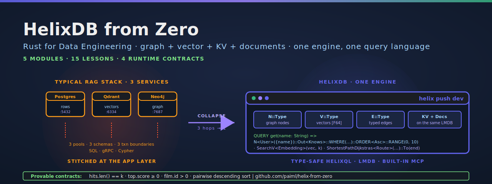

<p align="center">
  
</p>

[](https://github.com/paiml/helix-from-zero/actions/workflows/ci.yml)
[](#license)
[](rust-toolchain.toml)
[](Makefile)
[](contracts/)
[](Makefile)

# helix-from-zero

Companion repo for **HelixDB from Zero**, course 20 in the Coursera **Rust for Data Engineering** specialization (Pragmatic AI Labs · Noah Gift). Five modules, fifteen lessons, end-to-end from the first `.hx` schema to a typed Rust client that talks to a live HelixDB instance over HTTP.

## What HelixDB is

[HelixDB](https://github.com/HelixDB/helix-db) is an open-source graph + vector database written in Rust (AGPL-3.0, LMDB-backed). It collapses the typical RAG stack — Postgres for relational rows, Qdrant or Pinecone for vectors, Neo4j or pgvector for the graph — into one engine with one query language ([HelixQL](https://docs.helix-db.com/documentation/hql/hql)). The course is the from-zero counterpart: you write the `.hx` files, run them through `helix check`, push to a local instance with `helix push dev`, and watch a typed Rust client return the rows you asked for.

## Project layout

```
helix-from-zero/
├── helix.toml             # HelixDB project config (name + queries dir + local.dev port)
├── db/
│   ├── schema.hx          # N::User + N::Doc + V::Embedding + N::Location + their edges
│   └── queries.hx         # 15 lesson queries, one per video in the course
├── crates/helix-client/   # Typed Rust HTTP client + provable contracts (100% covered)
│   ├── src/
│   │   ├── lib.rs
│   │   ├── client.rs      # HelixClient — POSTs JSON to /query/<name>, decodes typed
│   │   ├── contracts.rs   # 4 pure runtime-contract functions (lesson 5.1.3)
│   │   ├── error.rs       # Error::{Http, Status} with is_http() + is_status() helpers
│   │   └── types.rs       # FilmHit + ListTopFilmsParams typed shapes
│   └── examples/list_top_films.rs   # The lesson 5.1.3 demo binary
├── contracts/helix-rust-v1.yaml     # Provable-contracts spec (linted by `pv lint`)
├── assets/hero.svg                  # README banner
├── Cargo.toml                       # Workspace
├── Makefile                         # `make verify` is the single CI gate
└── README.md
```

## Lesson map

| Module | Lesson | Query in `queries.hx` | What it shows |
| --- | --- | --- | --- |
| **M1 — Why HelixDB** | 1.1.1, 1.1.2, 1.1.3 | (conceptual — no live demo) | One engine for graph + vector + KV; the Helix stack; vs Postgres + Qdrant + Neo4j |
| **M2 — Schema + first queries** | 2.1.1, 2.1.2 | (schema-only) | `N::`, `V::`, `E::` shape; `INDEX`, field types, `DEFAULT` |
| | 2.1.3 | `addUser`, `addKnows`, `getUser` | First QUERY — `AddN`, `AddE`, `RETURN` |
| **M3 — helix-cli** | 3.1.1 | `listSchema` | `helix init` and the project layout (this repo) |
| | 3.1.2 | `typedReturnShape` | `helix check` and `helix compile` — type-safe pre-deploy |
| | 3.1.3 | `countUsers` | `helix push dev` — local instance and HTTP endpoints |
| **M4 — Graph + vector** | 4.1.1 | `youngFriends`, `friendsOfFriends` | `Out`, `In`, `WHERE`, `ORDER<Asc>`, `RANGE` |
| | 4.1.2 | `searchEmbedding` | `SearchV` — top-k vector similarity |
| | 4.1.3 | `routeDijkstra`, `routeBFS`, `routeWeightedDecay` | `ShortestPathDijkstras` + `ShortestPathBFS` with weight expressions |
| **M5 — Hybrid RAG + Rust client** | 5.1.1 | `addDocAndEmbedding`, `hitToDocs` | `Doc` → `Embedding` → `Edge` traversal |
| | 5.1.2 | `hybridSearch` | BM25 + vector fusion via the built-in reranker |
| | 5.1.3 | `listTopFilms` | Typed Rust client — `crates/helix-client/examples/list_top_films.rs` |

## Provable contracts

Every `assert!` in `crates/helix-client/examples/list_top_films.rs` is a pure function in `crates/helix-client/src/contracts.rs`, mirrored as a formal obligation in `contracts/helix-rust-v1.yaml`. The four contracts are the same shape that `c11` valkey-from-zero and `c13` rag-from-zero ship:

| Contract | Function | Obligation |
| --- | --- | --- |
| `helix_row_count_exact` | `assert_row_count` | `hits.len() == k` |
| `helix_top_score_non_negative` | `assert_top_score_non_negative` | `hits[0].score >= 0.0` |
| `helix_film_id_positive` | `assert_all_ids_positive` | `forall h. h.id > 0` |
| `helix_score_descending` | `assert_descending_sort` | `forall i. hits[i].score >= hits[i+1].score` |

Run the demo against a live `helix push dev` instance:

```bash
HELIX_URL=http://localhost:6969 cargo run -p helix-client --example list_top_films
```

If any contract fails, the demo exits non-zero with a typed `ContractViolation` and an actionable message that points at the offending row.

## Install

You need the [Helix CLI](https://github.com/HelixDB/helix-db) plus the
Rust toolchain pinned in `rust-toolchain.toml` (1.95+). The Helix CLI
installer drops a binary on PATH:

```bash
curl -sSL "https://install.helix-db.com" | bash
```

Clone this repo and let cargo materialise the workspace:

```bash
git clone https://github.com/paiml/helix-from-zero
cd helix-from-zero
make build
```

## Usage

### HelixQL side — schema, queries, push

From the repo root:

```bash
make check     # validate schema.hx + queries.hx (lesson 3.1.2)
make compile   # compile queries to workspace artifact
make push      # deploy to a local instance on port 6969 (lesson 3.1.3)
```

Every `QUERY name(args) =>` in `db/queries.hx` becomes an HTTP endpoint
at `http://localhost:6969/query/<name>`.

### Rust side — typed client, contracts, gates

```bash
make build         # cargo build --workspace
make test          # cargo test --workspace (30 tests, sub-second)
make lint          # cargo clippy -- -D warnings
make fmt-check     # cargo fmt --check
make coverage      # cargo llvm-cov with --fail-under-lines 100
make verify        # fmt-check + lint + test + coverage + pv lint contracts/
make comply        # pmat comply — paiml-wide compliance gate
```

`make verify` is the single command CI runs.

## Schema in one paragraph

`db/schema.hx` carries three independent sub-schemas so the lessons stay tight:

* **Users + Knows** for the M2 AddN/AddE walkthrough — the smallest possible graph that's still recognisable as a graph.
* **Locations + Routes** for the M4 Dijkstra/BFS demos — `Route` carries `distance`, `days_since_update`, `bandwidth`, and `reliability`, which is exactly enough surface to compose weighted shortest-path queries against.
* **Doc + Embedding + EmbeddingOf** for the M5 RAG demos — the canonical pattern where a `SearchV` hit walks back to its source document via the typed edge.

## License

Dual-licensed under [MIT](LICENSE-MIT) or [Apache-2.0](LICENSE-APACHE), at your option. HelixDB itself is AGPL-3.0; this companion repo links no Helix code, only its CLI and HTTP API, so the MIT/Apache choice on this code stays clean.

## Credit

Course author: [Noah Gift](https://github.com/noahgift) · [Pragmatic AI Labs](https://paiml.com).
HelixDB is built by the [HelixDB team](https://github.com/HelixDB).
